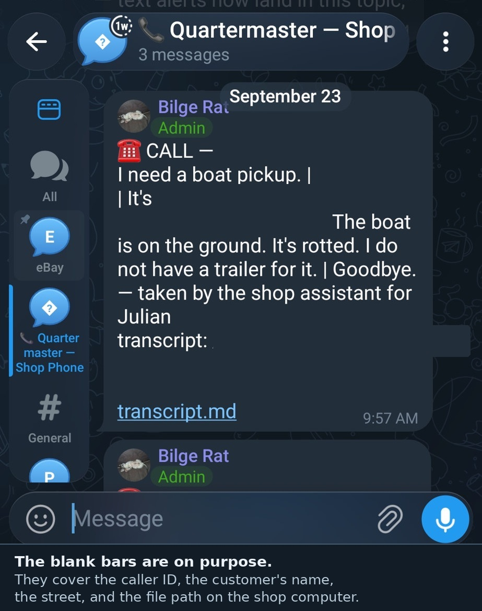

# ⚓ QUARTERMASTER

> *Every ship needs a voice at port. This one never sleeps, never drinks (much),
> and always takes a message for the Cap'n.*

**Quartermaster** is a self-hosted AI receptionist for your shop's phone. It
answers incoming **calls** over Bluetooth and holds a real conversation —
quotes your services, looks up order status, takes messages — and it handles
**SMS texts** the same way. Every exchange lands in your pocket via Telegram,
with compressed audio and a transcript archived on disk.

Built on a real salvage shop's phone line, where it now answers while the
Cap'n is elbow-deep in an engine bay.

```
        Caller
          ⇅  cellular
        Android phone          ← plugged into the bench, screen can sleep
          ⇅  Bluetooth HFP     ← voice (bluez-alsa)
        Linux box              ← whisper STT → knowledge base → LLM → TTS
          ⇅  wireless ADB      ← control channel (answer / hang up / SMS DB)
        Telegram               ← "☎️ CALL — (number): what they said"
```

---

## What it does

**Calls** — rings once, answers, greets, listens, thinks (soft blip), replies
in a natural voice. Knows your services and hours, answers order questions
from live data, takes messages with callback details, hangs up on "bye",
declines scam scripts mid-sentence, and never promises refunds, dates, or
your home address.

**Texts** — reads every incoming SMS over ADB, replies with the same brain,
loop-protected and contact-aware (saved contacts = personal, never
bot-replied).

**For the Cap'n** — Telegram alert after every call or text that took a
message: the number, what they wanted, escalation flag if it smelled like a
dispute or damage. Audio + transcript archived per call (`logs/`).

**Gaming mode** — one click (or `callscoot gaming on`) drops the heavyweight
voice model and swaps to a featherweight one so a 6 PM call never taxes your
GPU rig.

**Privacy, enforced in code** — answers come *only* from your knowledge files
and order data. No internet search. Saved contacts never get bot replies.
The bot cannot book times, promise refunds, or state your home address —
those rules are in the prompt *and* the guardrails.

---

## Requirements

| What | Notes |
|---|---|
| Linux PC + Bluetooth adapter | tested on Mint 22 / PipeWire 1.x, 16 threads |
| Android 11+ phone | spare/bench phone, SIM active, on the same Wi-Fi |
| Phone + PC paired over Bluetooth | the PC acts as the phone's **headset** |
| Wireless debugging | Developer options → pair once |
| mic + speakers or headset | on the PC (this is the phone's "headset") |
| API keys (optional) | any OpenAI-compatible LLM endpoint; Groq free tier works |
| Telegram | a bot you create, plus one chat, group, or forum topic for alerts |
| Python 3.11+ | stdlib only for the core; whisper/kokoro installed separately |

> **Heads-up:** this stack was tuned on a real phone and it works, but Linux
> Bluetooth HFP is famously moody. The troubleshooting section covers the
> traps that bit during development.

---

## Setup — the phone (5 minutes)

1. **Pair the phone and PC over Bluetooth** (Settings → Bluetooth → tap the
   PC). Allow **call audio** when prompted.
2. **Developer options**: tap Build number ×7 in About phone. Then enable
   **Wireless debugging** and pair from the PC:
   ```bash
   adb pair PHONE_IP:PAIR_PORT     # 6-digit code from the phone
   callscoot adb-connect
   ```
3. **Turn OFF RCS chat features** — critical! Messages app → profile avatar →
   Messages settings → **RCS chats** → toggle off. RCS texts are invisible to
   ADB; with it off, everything arrives as plain SMS where the bot lives.
4. **Save your unlock PIN** (so the bot can open the messaging app to send
   replies — the file never leaves the machine):
   ```bash
   read -s -p "phone PIN: " P && printf '%s' "$P" > ~/callscoot/.pin && chmod 600 ~/callscoot/.pin && unset P
   ```
5. Put the phone **on a charger** on the bench. Done — no cable ever again.

## Setup — the PC (10 minutes)

```bash
git clone https://github.com/jollyroger1480/quartermaster.git
cd quartermaster

# 1. Bluetooth call-audio daemon (HFP) — the part Linux makes hard
sudo bash scripts/install-bluealsa.sh

# 2. Python brains
pip install --user --break-system-packages faster-whisper kokoro espeakng-loader phonemizer-fork
pip install --user --break-system-packages "https://github.com/explosion/spacy-models/releases/download/en_core_web_sm-3.8.0/en_core_web_sm-3.8.0-py3-none-any.whl"

# 3. Also install piper (fallback voice) and put a voice model in ~/.local/share/piper/
#    (any voice works — it only speaks when kokoro hiccups)

# 4. Configure
cp callscoot.example.toml callscoot.toml
$EDITOR callscoot.toml          # your shop name, phone MAC, LLM keys

# 5. Keys — loaded automatically at startup. Telegram steps are the next section.
$EDITOR .env                    # GROQ_API_KEY=...  ZAI_API_KEY=...  TELEGRAM_BOT_TOKEN=...

# 6. Health check
bin/callscoot doctor
```

## Setup — Telegram

Calls and texts still get answered, and the transcript still lands in
`logs/`, if Telegram is not set up. The digest on your phone is a separate
step. Quartermaster only **sends**. It does not read your Telegram chats.

1. Install Telegram on the phone that should get the alerts. That can be the
   shop phone or any other phone you carry.
2. In Telegram, open **@BotFather**, send `/newbot`, and follow the prompts.
   Copy the token. It looks like `123456789:AA...`. Treat it like a password.
3. Put it in `.env` next to `callscoot.toml` (this file is git-ignored):
   ```bash
   umask 077
   printf 'TELEGRAM_BOT_TOKEN=%s\n' 'paste-token-here' >> .env
   ```
4. Open a chat the bot is allowed to post in:
   - **Private:** open your new bot and tap **Start**. Until you do, Telegram
     refuses the send.
   - **Group:** make a group, add the bot, and send one message in the group.
   - **Forum topic:** turn Topics on for that group, add the bot, and send
     one message inside the topic you want.
5. Ask Telegram for the id. From the same directory, after that message:
   ```bash
   set -a; source .env; set +a
   curl -s "https://api.telegram.org/bot${TELEGRAM_BOT_TOKEN}/getUpdates"
   ```
   In the JSON, `chat.id` is the destination. A private chat is a positive
   number. A group starts with `-100`. Inside a forum topic, also copy
   `message_thread_id`.
6. Tell Quartermaster where to post. Either line works. The toml value wins
   when it is not empty.
   ```bash
   # .env  — whole chat
   echo 'TELEGRAM_HOME_CHANNEL=-1001234567890' >> .env
   # .env  — one forum topic (chat id, a colon, topic id)
   echo 'TELEGRAM_HOME_CHANNEL=-1001234567890:3' >> .env
   ```
   Or set `alerts.telegram_chat` in `callscoot.toml` to that same string.
   Leave `alerts.telegram = true`.
7. Prove the bot can post before you trust a live call. A chat with no topic:
   ```bash
   set -a; source .env; set +a
   curl -s -X POST "https://api.telegram.org/bot${TELEGRAM_BOT_TOKEN}/sendMessage" \
     --data-urlencode "chat_id=${TELEGRAM_HOME_CHANNEL}" \
     --data-urlencode "text=Quartermaster test"
   ```
   A forum topic (`chatid:topicid` in `TELEGRAM_HOME_CHANNEL`):
   ```bash
   set -a; source .env; set +a
   curl -s -X POST "https://api.telegram.org/bot${TELEGRAM_BOT_TOKEN}/sendMessage" \
     --data-urlencode "chat_id=${TELEGRAM_HOME_CHANNEL%%:*}" \
     --data-urlencode "message_thread_id=${TELEGRAM_HOME_CHANNEL#*:}" \
     --data-urlencode "text=Quartermaster test"
   ```
   A working send returns `"ok":true`, and the message shows up in Telegram.

After a real call or text, the watcher posts a short digest: who called, what
they said, and `transcript: <path on this computer>`. The phone can read that
message. It cannot open the `.md` file, because that path is on the shop
computer, not on the phone.

## Setup — the knowledge (this is the magic)

The bot answers **only** from files in `knowledge/` and your config. That
folder is the difference between a receptionist and a liability:

- `knowledge/services.md` — your services and pricing rules (template provided)
- anything else you drop in — policies, FAQs, parts notes, whatever
- optional: wire `[orders]` in the config to a live order export and the bot
  answers "where's my order" from real records, buyer-name matched

If the answer isn't on file, the bot says so and takes a message. It does not
hallucinate prices to paying customers.

How to write the price list, the hours, and the lines the model is not allowed
to rewrite: [Business guardrails](docs/business-guardrails.md).

## Run it

```bash
bin/callscoot watch          # auto-answer + auto-text. Ctrl+C to stop.
```

Run at boot:

```bash
cp systemd/callscoot-watch.service ~/.config/systemd/user/
sed -i 's|%h/callscoot|'"$(cd .. && pwd)"'|' ~/.config/systemd/user/callscoot-watch.service
systemctl --user daemon-reload && systemctl --user enable --now callscoot-watch
journalctl --user -u callscoot-watch -f
```

## CLI

| Command | What it does |
|---|---|
| `callscoot doctor` | checks every layer, prints the exact next fix |
| `callscoot status` | call state + Bluetooth audio nodes |
| `callscoot adb-connect` | (re)connect wireless ADB |
| `callscoot listen` | capture one utterance from the phone, print the transcription |
| `callscoot ask "question"` | ask the brain a question without a phone call |
| `callscoot index` | refresh the order snapshots |
| `callscoot gaming on/off` | drop the heavy voice model, switch to piper |
| `callscoot unlock` | wake + unlock the phone (saved PIN) |
| `callscoot watch` | THE switch — live receptionist |

## Configuration

Everything lives in `callscoot.toml` — full annotated reference in
[`callscoot.example.toml`](callscoot.example.toml). Highlights:

| Key | Meaning |
|---|---|
| `phone.allowlist` | numbers always answered; `answer_unknown = false` makes it allowlist-only |
| `call.ring_delay_s` | rings before pickup |
| `record_silence_s` | pause length before the bot thinks it's her turn (1.5 = patient) |
| `tts.backend` | `kokoro` (natural) or `piper` (featherweight) |
| `persona.shop_hours` | the ONLY hours it may speak — empty = it punts instead of inventing |
| `spam.blacklist` | numbers never answered |
| `alerts.telegram` | `true` sends the digest; `false` keeps transcripts local only |
| `alerts.telegram_chat` | chat id, or `chatid:topicid`; empty uses `TELEGRAM_HOME_CHANNEL` |

Keys go in `.env` (git-ignored): `GROQ_API_KEY`, `ZAI_API_KEY`,
`TELEGRAM_BOT_TOKEN`, `TELEGRAM_HOME_CHANNEL`. See **Setup — Telegram**.

## Troubleshooting (the traps we fell into so ye don't have to)

- **"Phone audio" missing on the phone's Bluetooth page** → the PC isn't
  advertising hands-free. Check `bluealsad` is running with `-p hfp-hf` and
  re-pair the phone.
- **Caller silent / no audio nodes** → an A2DP-vs-HFP profile fight. Force
  the headset role: `bluez5.headset-roles = [ hfp_hf ]` in WirePlumber config.
- **Choppy voice** → disable mSBC (`bluez5.enable-msbc = false`), fall back
  to CVSD. Narrowband is fine for calls.
- **Can't see texts in the bot** → RCS is on. Turn chat features OFF
  (see phone setup step 3). RCS never touches the SMS database.
- **Bot replies to your friends' texts** → that's the contacts guard being
  off; saved contacts are skipped by default.
- **Bot cut someone off mid-sentence** → raise `record_silence_s`.
- **First response slow** → that's the models cold-loading; keep the watcher
  running (it pre-warms at startup).
- **`alert skipped: telegram not configured`** → `.env` has no
  `TELEGRAM_BOT_TOKEN`, or both `alerts.telegram_chat` and
  `TELEGRAM_HOME_CHANNEL` are empty. Setup — Telegram, steps 3 and 6.
- **`telegram send failed` / HTTP 401** → the bot token is wrong. Ask
  @BotFather for `/token` and replace the line in `.env`.
- **HTTP 400 chat not found, or HTTP 403** → the bot is not in that chat, the
  id is from a different bot, or you never tapped Start in a private chat.
  For a topic, `message_thread_id` has to be the number from `getUpdates`,
  not the topic's name.
- **The Telegram message arrived but the `.md` link does nothing** → the
  digest includes a file path on the shop computer. The phone has nowhere to
  open it. The message text is the whole alert.
- **Something failed and the journal is only one line** → debug logging is on.
  `logs/errors.log` (same folder as the call transcripts) has the watch lines
  and the traceback. The same error is written once, then counted, so a retry
  loop does not fill the file. Set `CALLSCOOT_LOG=INFO` to quiet the debug lines.

---

## On the line (September 23, 2026)

Boat-pickup test call. Quartermaster answered, took the message, and posted
the transcript into Telegram on the shop phone. The phone still cannot open
`transcript.md` from that chat: the alert links a file on the shop computer.

The blank bars in the photo are on purpose. They cover the caller ID, the
customer's name, the street, and the file path on the shop computer.



---

## Tip jar 🏴‍☠️

If this here code hauled ye out of a phone-call nightmare and ye feel like
tossing a coin in the bucket:

**Cash App: [`$jollyroger1480`](https://cash.app/$jollyroger1480)**

Fair winds, and may your customers all read the FAQ.

## License

[MIT](LICENSE) — do what ye will. Built and bloodied on a real shop line by
[Cap'n Jules the Rustjack](https://github.com/jollyroger1480) of
[Buccaneer Salvage](https://buccaneersalvage.github.io/).

Full provider and component credits: [CREDITS.md](CREDITS.md).
